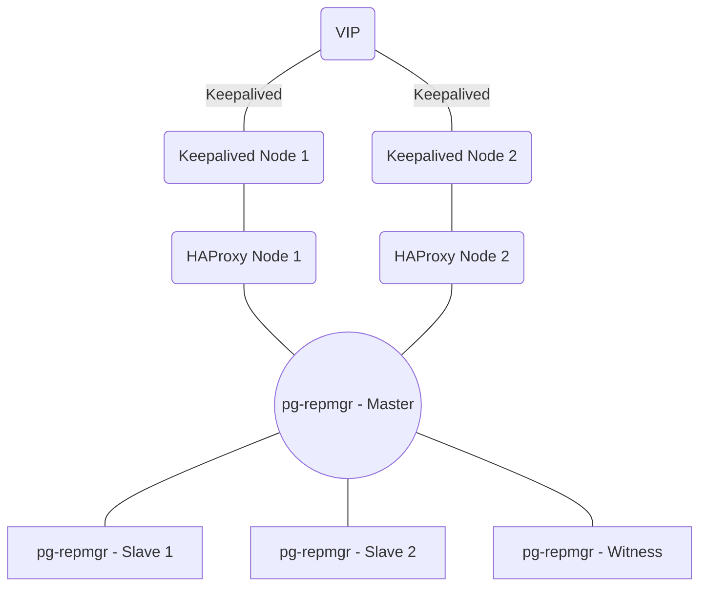

## 部署Postgresql 集群

>:warning: **这里部署和维护都是在/root 目录下，操作都是使用`root `用户，请留意。**


> :warning: **如果条件允许，建议各个集群都能独自使用自己的服务器资源，而非与其他集群共享，以免高负载时存在资源争抢导致故障的问题。**

### 1.1 使用方式

```shell
# 上传部署文件
postgresql-cluster

# 导入镜像
cd postgresql-cluster
docker load -i postgresql-repmgr.tar

# 创建目录并授权
mkdir -p /data/postgres/{master,standby1,standby2,witness}
chown -R 1001:1001 /data/postgres/
chmod -R 700       /data/postgres/

# 自定义配置
cp .env.example .env
vim .env # 请结合自己的情况修改配置后再启动

# 启动
docker-compose up -d
```


完成启动后：

```shell
root@DEVOPS:~/postgresql-cluster# docker-compose ps -a 
NAME                         IMAGE                                    COMMAND                  SERVICE   CREATED          STATUS          PORTS
postgresql-cluster-pg-0-1    docker.io/bitnami/postgresql-repmgr:16   "/opt/bitnami/script…"   pg-0      10 minutes ago   Up 10 minutes   0.0.0.0:5433->5432/tcp, :::5433->5432/tcp
postgresql-cluster-pg-1-1    docker.io/bitnami/postgresql-repmgr:16   "/opt/bitnami/script…"   pg-1      10 minutes ago   Up 10 minutes   0.0.0.0:5434->5432/tcp, :::5434->5432/tcp
postgresql-cluster-pg-2-1    docker.io/bitnami/postgresql-repmgr:16   "/opt/bitnami/script…"   pg-2      10 minutes ago   Up 10 minutes   0.0.0.0:5455->5432/tcp, :::5455->5432/tcp
postgresql-cluster-pgw-0-1   docker.io/bitnami/postgresql-repmgr:16   "/opt/bitnami/script…"   pgw-0     10 minutes ago   Up 10 minutes   0.0.0.0:5456->5432/tcp, :::5456->5432/tcp
```


这里的`postgresql-cluster-pg-0-1` 即为默认的主数据库。客户端连接数据库时使用`主机IP + 主数据库的端口 + 自定义的密码`来连接即可。

### 1.2 验证方式

#### 1.2.1 执行SHELL

```shell
root@DEVOPS:~/postgresql-cluster# docker-compose exec -it pg-1 bash
I have no name!@b35644d432db:/$ /opt/bitnami/scripts/postgresql-repmgr/entrypoint.sh repmgr -f /opt/bitnami/repmgr/conf/repmgr.conf cluster show
sql-repmgr 16:08:48.21postgresql-repmgr 03:27:29.99 INFO  ==> 
postgresql-repmgr 03:27:29.99 INFO  ==> Welcome to the Bitnami postgresql-repmgr container
postgresql-repmgr 03:27:29.99 INFO  ==> Subscribe to project updates by watching https://github.com/bitnami/containers
postgresql-repmgr 03:27:29.99 INFO  ==> Submit issues and feature requests at https://github.com/bitnami/containers/issues
postgresql-repmgr 03:27:29.99 INFO  ==>

 ID   | Name  | Role    | Status    | Upstream | Location | Priority | Timeline | Connection string
------+-------+---------+-----------+----------+----------+----------+----------+------------------------------------------------------------------------------------------
 1000 | pg-0  | primary | * running |          | default  | 100      | 1        | user=repmgr password=repmgrpassword host=pg-0 dbname=repmgr port=5432 connect_timeout=5
 1001 | pg-1  | standby |   running | pg-0     | default  | 100      | 1        | user=repmgr password=repmgrpassword host=pg-1 dbname=repmgr port=5432 connect_timeout=5
 1002 | pg-2  | standby |   running | pg-0     | default  | 100      | 1        | user=repmgr password=repmgrpassword host=pg-2 dbname=repmgr port=5432 connect_timeout=5
 2000 | pgw-0 | witness | * running | pg-0     | default  | 0        | n/a      | user=repmgr password=repmgrpassword host=pgw-0 dbname=repmgr port=5432 connect_timeout=5
I have no name!@b35644d432db:/$
```


#### 1.2.2 执行SQL

```sql
SELECT * FROM pg_replication_slots;

SELECT * FROM pg_stat_replication;


SELECT
  application_name,
  state,
  sync_priority,
  sync_state,
  pg_wal_lsn_diff(pg_current_wal_lsn(), replay_lsn) AS replication_lag
FROM
  pg_stat_replication;
  
 
SELECT pg_last_wal_receive_lsn() = pg_last_wal_replay_lsn() AS is_synced;
```

#### 1.2.3 故障转移

> 手动关闭主数据库，静待30s~60s左右，等集群检查主数据库完全连接重试超时后，再查主从关系，即可发现主数据库的角色已经由原来的从库自动继承并切换了。


```shell
root@DEVOPS:~/postgresql-cluster# docker stop postgresql-cluster-pg-0-1 
root@DEVOPS:~/postgresql-cluster# docker-compose exec -it pg-1 bash
I have no name!@e78ebc8e36de:/$ /opt/bitnami/scripts/postgresql-repmgr/entrypoint.sh repmgr -f /opt/bitnami/repmgr/conf/repmgr.conf cluster show
postgresql-repmgr 06:35:14.77 INFO  ==> 
postgresql-repmgr 06:35:14.77 INFO  ==> Welcome to the Bitnami postgresql-repmgr container
postgresql-repmgr 06:35:14.77 INFO  ==> Subscribe to project updates by watching https://github.com/bitnami/containers
postgresql-repmgr 06:35:14.77 INFO  ==> Submit issues and feature requests at https://github.com/bitnami/containers/issues
postgresql-repmgr 06:35:14.78 INFO  ==>


 ID   | Name  | Role    | Status    | Upstream | Location | Priority | Timeline | Connection string
------+-------+---------+-----------+----------+----------+----------+----------+------------------------------------------------------------------------------------------
 1000 | pg-0  | primary | - failed  | ?        | default  | 100      |          | user=repmgr password=repmgrpassword host=pg-0 dbname=repmgr port=5432 connect_timeout=5
 1001 | pg-1  | primary | * running |          | default  | 100      | 2        | user=repmgr password=repmgrpassword host=pg-1 dbname=repmgr port=5432 connect_timeout=5
 1002 | pg-2  | standby |   running | pg-1     | default  | 100      | 1        | user=repmgr password=repmgrpassword host=pg-2 dbname=repmgr port=5432 connect_timeout=5
 2000 | pgw-0 | witness | * running | pg-1     | default  | 0        | n/a      | user=repmgr password=repmgrpassword host=pgw-0 dbname=repmgr port=5432 connect_timeout=5

WARNING: following issues were detected
  - unable to connect to node "pg-0" (ID: 1000)

HINT: execute with --verbose option to see connection error messages
```


> 再手动恢复之前故障的主数据库，能发现新的主从关系并未发生变更，而是旧的主数据库自动注册成从数据库。

```shell
root@DEVOPS:~/postgresql-cluster# docker-compose ps -a 
NAME                         IMAGE                                    COMMAND                  SERVICE   CREATED         STATUS                     PORTS
postgresql-cluster-pg-0-1    docker.io/bitnami/postgresql-repmgr:16   "/opt/bitnami/script…"   pg-0      8 minutes ago   Exited (0) 7 minutes ago
postgresql-cluster-pg-1-1    docker.io/bitnami/postgresql-repmgr:16   "/opt/bitnami/script…"   pg-1      8 minutes ago   Up 8 minutes               0.0.0.0:5434->5432/tcp, :::5434->5432/tcp
postgresql-cluster-pg-2-1    docker.io/bitnami/postgresql-repmgr:16   "/opt/bitnami/script…"   pg-2      8 minutes ago   Up 8 minutes               0.0.0.0:5455->5432/tcp, :::5455->5432/tcp
postgresql-cluster-pgw-0-1   docker.io/bitnami/postgresql-repmgr:16   "/opt/bitnami/script…"   pgw-0     8 minutes ago   Up 8 minutes               0.0.0.0:5456->5432/tcp, :::5456->5432/tcp
root@DEVOPS:~/postgresql-cluster# docker start postgresql-cluster-pg-0-1
postgresql-cluster-pg-0-1
root@DEVOPS:~/postgresql-cluster# docker-compose ps -a
NAME                         IMAGE                                    COMMAND                  SERVICE   CREATED         STATUS         PORTS
postgresql-cluster-pg-0-1    docker.io/bitnami/postgresql-repmgr:16   "/opt/bitnami/script…"   pg-0      9 minutes ago   Up 1 second    0.0.0.0:5433->5432/tcp, :::5433->5432/tcp
postgresql-cluster-pg-1-1    docker.io/bitnami/postgresql-repmgr:16   "/opt/bitnami/script…"   pg-1      9 minutes ago   Up 9 minutes   0.0.0.0:5434->5432/tcp, :::5434->5432/tcp
postgresql-cluster-pg-2-1    docker.io/bitnami/postgresql-repmgr:16   "/opt/bitnami/script…"   pg-2      9 minutes ago   Up 9 minutes   0.0.0.0:5455->5432/tcp, :::5455->5432/tcp
postgresql-cluster-pgw-0-1   docker.io/bitnami/postgresql-repmgr:16   "/opt/bitnami/script…"   pgw-0     9 minutes ago   Up 9 minutes   0.0.0.0:5456->5432/tcp, :::5456->5432/tcp

root@DEVOPS:~/postgresql-cluster# docker-compose exec -it pg-1 bash
I have no name!@e78ebc8e36de:/$ 
I have no name!@e78ebc8e36de:/$ /opt/bitnami/scripts/postgresql-repmgr/entrypoint.sh repmgr -f /opt/bitnami/repmgr/conf/repmgr.conf cluster show
postgresql-repmgr 06:41:48.43 INFO  ==> 
postgresql-repmgr 06:41:48.43 INFO  ==> Welcome to the Bitnami postgresql-repmgr container
postgresql-repmgr 06:41:48.43 INFO  ==> Subscribe to project updates by watching https://github.com/bitnami/containers
postgresql-repmgr 06:41:48.43 INFO  ==> Submit issues and feature requests at https://github.com/bitnami/containers/issues
postgresql-repmgr 06:41:48.43 INFO  ==>

 ID   | Name  | Role    | Status    | Upstream | Location | Priority | Timeline | Connection string
------+-------+---------+-----------+----------+----------+----------+----------+------------------------------------------------------------------------------------------
 1000 | pg-0  | standby |   running | pg-1     | default  | 100      | 2        | user=repmgr password=repmgrpassword host=pg-0 dbname=repmgr port=5432 connect_timeout=5
 1001 | pg-1  | primary | * running |          | default  | 100      | 2        | user=repmgr password=repmgrpassword host=pg-1 dbname=repmgr port=5432 connect_timeout=5
 1002 | pg-2  | standby |   running | pg-1     | default  | 100      | 2        | user=repmgr password=repmgrpassword host=pg-2 dbname=repmgr port=5432 connect_timeout=5
 2000 | pgw-0 | witness | * running | pg-1     | default  | 0        | n/a      | user=repmgr password=repmgrpassword host=pgw-0 dbname=repmgr port=5432 connect_timeout=5
 
 
```


> 测试完成后，清理集群，清理数据目录，然后还原部署

```shell
I have no name!@e78ebc8e36de:/$ 
exit
root@DEVOPS:~/postgresql-cluster# docker-compose down 
[+] Running 5/5
 ✔ Container postgresql-cluster-pg-1-1   Removed                                                                                                                                                                                     1.3s 
 ✔ Container postgresql-cluster-pg-2-1   Removed                                                                                                                                                                                     0.9s 
 ✔ Container postgresql-cluster-pgw-0-1  Removed                                                                                                                                                                                     1.5s 
 ✔ Container postgresql-cluster-pg-0-1   Removed                                                                                                                                                                                     1.4s 
 ✔ Network postgresql-cluster_default    Removed                                                                                                                                                                                     0.7s 
root@DEVOPS:~/postgresql-cluster# rm /data/postgres/ -rf 

root@DEVOPS:~/postgresql-cluster# mkdir -p /data/postgres/{master,standby1,standby2,witness}
root@DEVOPS:~/postgresql-cluster# chown -R 1001:1001 /data/postgres/
root@DEVOPS:~/postgresql-cluster# chmod -R 700       /data/postgres/
root@DEVOPS:~/postgresql-cluster# docker-compose up -d 
[+] Running 5/5
 ✔ Network postgresql-cluster_default    Created                                                                                                                                                                                     0.2s 
 ✔ Container postgresql-cluster-pgw-0-1  Started                                                                                                                                                                                     0.0s 
 ✔ Container postgresql-cluster-pg-1-1   Started                                                                                                                                                                                     0.0s 
 ✔ Container postgresql-cluster-pg-0-1   Started                                                                                                                                                                                     0.0s 
 ✔ Container postgresql-cluster-pg-2-1   Started                                                                                                                                                                                     0.0s 
root@DEVOPS:~/postgresql-cluster# docker-compose ps -a 
NAME                         IMAGE                                    COMMAND                  SERVICE   CREATED         STATUS         PORTS
postgresql-cluster-pg-0-1    docker.io/bitnami/postgresql-repmgr:16   "/opt/bitnami/script…"   pg-0      5 seconds ago   Up 4 seconds   0.0.0.0:5433->5432/tcp, :::5433->5432/tcp
postgresql-cluster-pg-1-1    docker.io/bitnami/postgresql-repmgr:16   "/opt/bitnami/script…"   pg-1      5 seconds ago   Up 4 seconds   0.0.0.0:5434->5432/tcp, :::5434->5432/tcp
postgresql-cluster-pg-2-1    docker.io/bitnami/postgresql-repmgr:16   "/opt/bitnami/script…"   pg-2      5 seconds ago   Up 5 seconds   0.0.0.0:5455->5432/tcp, :::5455->5432/tcp
postgresql-cluster-pgw-0-1   docker.io/bitnami/postgresql-repmgr:16   "/opt/bitnami/script…"   pgw-0     5 seconds ago   Up 4 seconds   0.0.0.0:5456->5432/tcp, :::5456->5432/tcp
```


#### 1.2.4 数据备份


```shell
# 手动执行物理备份
deepin-1:~/postgresql-cluster# ./pg_basebackup.sh 
postgresql-repmgr 02:56:17.79 INFO  ==> 
postgresql-repmgr 02:56:17.80 INFO  ==> Welcome to the Bitnami postgresql-repmgr container
postgresql-repmgr 02:56:17.80 INFO  ==> Subscribe to project updates by watching https://github.com/bitnami/containers
postgresql-repmgr 02:56:17.80 INFO  ==> Submit issues and feature requests at https://github.com/bitnami/containers/issues
postgresql-repmgr 02:56:17.80 INFO  ==> 

 ID   | Name  | Role    | Status    | Upstream | Location | Priority | Timeline | Connection string                                                                       
------+-------+---------+-----------+----------+----------+----------+----------+------------------------------------------------------------------------------------------
 1000 | pg-0  | standby |   running | pg-1     | default  | 100      | 2        | user=repmgr password=repmgrpassword host=pg-0 dbname=repmgr port=5432 connect_timeout=5 
 1001 | pg-1  | primary | * running |          | default  | 100      | 2        | user=repmgr password=repmgrpassword host=pg-1 dbname=repmgr port=5432 connect_timeout=5 
 1002 | pg-2  | standby |   running | pg-1     | default  | 100      | 2        | user=repmgr password=repmgrpassword host=pg-2 dbname=repmgr port=5432 connect_timeout=5 
 2000 | pgw-0 | witness | * running | pg-1     | default  | 0        | n/a      | user=repmgr password=repmgrpassword host=pgw-0 dbname=repmgr port=5432 connect_timeout=5
Backup was successful on the primary node (pg-1).

# 备份日志位置
deepin-1:~/postgresql-cluster# ll /data/postgresql_backup/
total 44
-rw-r--r-- 1 root root    80 Feb  4 18:02 2024-02-04_backup.log
-rw-r--r-- 1 root root 33256 Feb  5 10:56 2024-02-05_backup.log

# 默认开启归档。
deepin-1:~/postgresql-cluster# ll /data/postgres/standby1/data/pg_wal/
total 180236
-rw------- 1 1001 root 16777216 Feb  4 11:52 000000010000000000000007
-rw------- 1 1001 root 16777216 Feb  4 17:19 000000010000000000000008
-rw------- 1 1001 root 16777216 Feb  4 17:19 000000010000000000000009
-rw------- 1 1001 root 16777216 Feb  4 17:24 00000001000000000000000A.partial
-rw------- 1 1001 root 16777216 Feb  4 17:47 00000002000000000000000A
-rw------- 1 1001 root 16777216 Feb  4 17:47 00000002000000000000000B
-rw------- 1 1001 root 16777216 Feb  5 10:22 00000002000000000000000C
-rw------- 1 1001 root 16777216 Feb  5 10:22 00000002000000000000000D
-rw------- 1 1001 root 16777216 Feb  5 10:56 00000002000000000000000E
-rw------- 1 1001 root 16777216 Feb  5 10:56 00000002000000000000000F
-rw------- 1 1001 root      338 Feb  5 10:56 00000002000000000000000F.00000028.backup
-rw------- 1 1001 root 16777216 Feb  5 10:56 000000020000000000000010
-rw------- 1 1001 root       41 Feb  4 17:47 00000002.history
drwx------ 2 1001 root     4096 Feb  5 10:56 archive_status

# 是否需要执行定时物理备份，取决于自己的项目，不再赘述。
```


### 1.3 高可用集群模式

#### 1.3.1 需求背景

在上面主从集群上面，虽然能够做到故障自动转移，但是因为应用程序是连接的主数据库，所以主从关系变了，配置就需要同步更新+重启所有应用程序以生效新的主数据库。这样一来就存在一定多余的人工成本，因此需要对应用屏蔽这层复杂性，让应用对故障转移过程中的主从关系变更完全无感知。


#### 1.3.2 逻辑架构

具体实现方案即通过`VIP + Keepalived + Haproxy` 方案实现内网的LB 负载同时隐藏后端真实主从关系。

之前用户的应用是通过主数据库的IP和端口连接，现在即为`VIP+端口` 来配置使用即可。

逻辑架构如下图：




**优点：**

1. 不用再担心集群发生故障转移后需要更新配置与重启应用。
2. 真正意义上的高可用（如果忽略上面数据库集群是部署在单个Docker主机上面的话）。


**缺点：**

1. 需要增加两台低配置的服务器来做LB 节点。
2. 需要在两台LB 节点分别部署`Keepalived + Haproxy` 。
3. 需要业主提供一个内网未被使用的IP地址，且以后也不可以被占用或使用，用来做VIP 使用。


综上，请结合自己项目的实际情况，来考虑是否需要在原主从集群基础上拓展为高可用集群。


#### 1.3.3 使用方式

如前面所言，准备两个新的LB 节点 + VIP。

> 因为需要走物理网络，所以这里需要通过离线安装包来部署。

```shell
# 安装 keepalived haproxy
## 能联网机器的上面
sudo apt-get update
rm /var/cache/apt/archives/* -rf 
sudo apt-get install --download-only keepalived haproxy

cd 
mkdir -p debian-offline-packages
cd debian-offline-packages
cp /var/cache/apt/archives/*.deb /root/debian-offline-packages
dpkg-scanpackages . /dev/null | gzip -9c > Packages.gz

## 不能联网机器的上面
mkdir -p /opt/repo
cp -r /root/debian-offline-packages/* /opt/repo
echo 'deb [trusted=yes] file:///path/to/local/repo ./' | sudo tee /etc/apt/sources.list.d/local-offline-repo.list
sudo apt-get update
sudo apt-get install keepalived haproxy
```


**LB1 上面：**

```shell
# 上传文件：lb1


# 更新配置文件
cd lb1
vim haproxy.cfg     # 更新配置文件里面的PG 数据库集群的IP和端口
vim keepalived.conf # 更新配置文件里面的物理IP，VIP，物理网卡名称

\cp -rvf haproxy.cfg     /etc/haproxy/haproxy.cfg
\cp -rvf keepalived.conf /etc/haproxy/keepalived.conf

haproxy -c -f /etc/haproxy/haproxy.cfg
systemctl start  haproxy.service
systemctl enable  haproxy.service
systemctl status haproxy.service -l --no-pager

systemctl start  keepalived.service 
systemctl enable keepalived.service 
systemctl status keepalived.service  -l --no-pager
```


**LB2 上面：**

```shell
# 上传文件：lb2


# 更新配置文件
cd lb2
vim haproxy.cfg     # 更新配置文件里面的PG 数据库集群的IP和端口
vim keepalived.conf # 更新配置文件里面的物理IP，VIP，物理网卡名称

\cp -rvf haproxy.cfg     /etc/haproxy/haproxy.cfg
\cp -rvf keepalived.conf /etc/haproxy/keepalived.conf

haproxy -c -f /etc/haproxy/haproxy.cfg
systemctl start  haproxy.service
systemctl enable  haproxy.service
systemctl status haproxy.service -l --no-pager

systemctl start  keepalived.service 
systemctl enable keepalived.service 
systemctl status keepalived.service  -l --no-pager
```